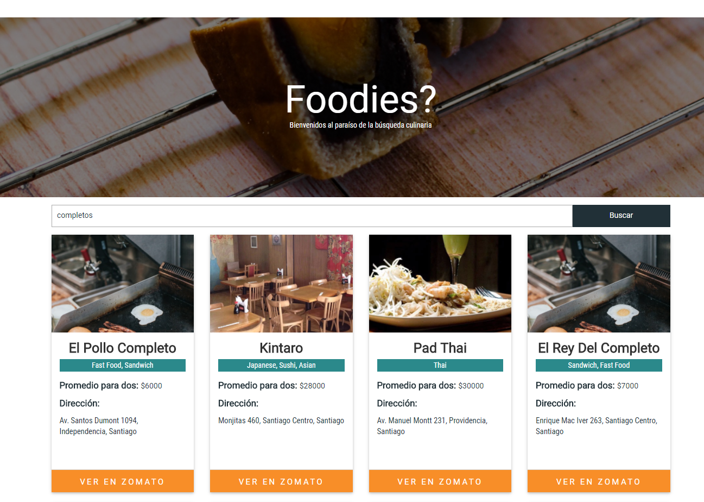
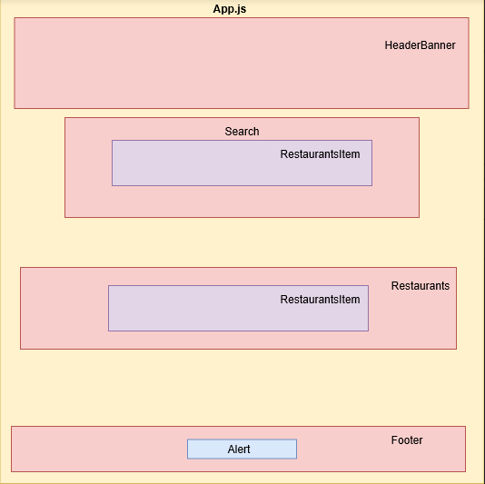

   

# Foodies React
***
Foodies busca informar a los amantes de la comida sobre sus opciones de restaurantes más cercanos a travez de una aplicación web responsive de uso intuitivo.
***

### Requerimientos Técnicos

El proyecto fue realizado con las siguientes dependencias:

##### Dependencias de Producción
  - Bootstrap ~v. 3.3.7
  - sweetalert-react: ^0.4.11

##### Dependencias de Desarrollo
  -npm
  -firebase ^4.11.0  
  -react ^16.2.0
  -react-dom ^16.2.0
  -react-scripts 1.1.1
  -sweetalert-react: ^0.4.11

### Uso
+ Ingresa a [Foodies](https://meliveloz.github.io/foodmap-react)
+ Heroku [Foodies](https://fathomless-retreat-74717.herokuapp.com/)

### Ejemplo

### Wireframe

